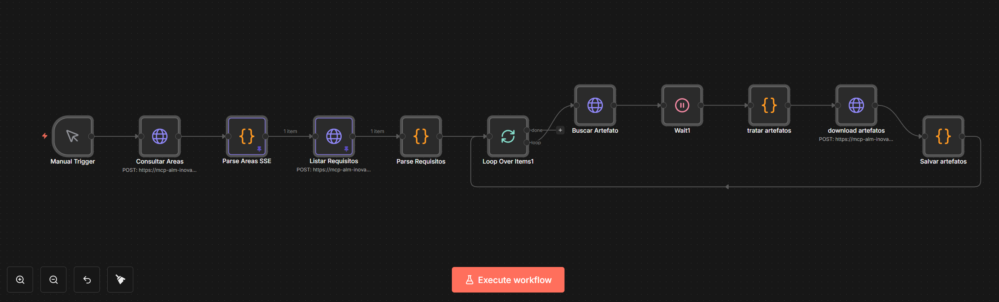
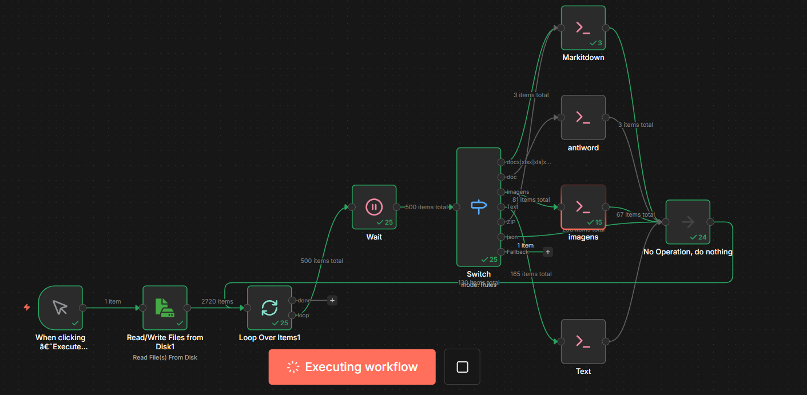
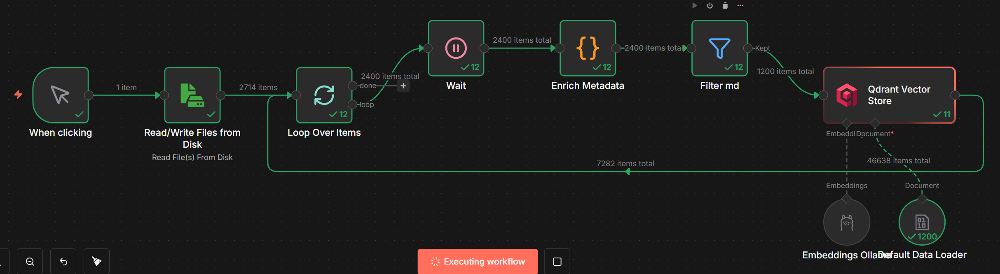
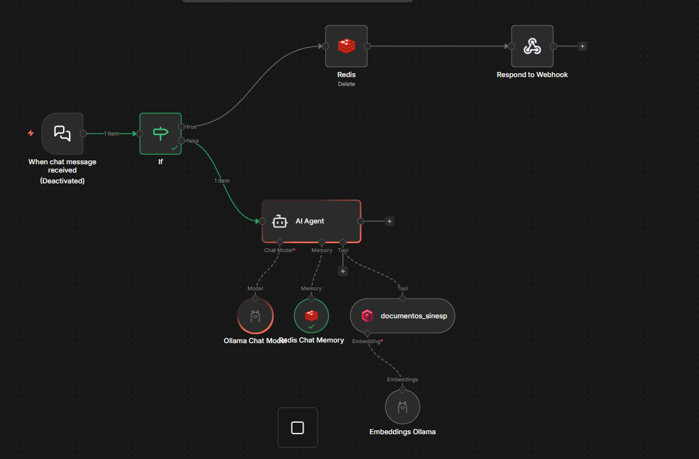

# Sobre

Projeto docker que executa o n8n, ollama e qdrant

# Acesso

- [http://localhost:5678](http://localhost:5678)

## how

Para buildar o docker do zero

```ps
scripts/try_all.ps1
```

Para iniciar

```ps
scripts/start.ps1
```

O volume local aponta para a pasta `arquivos_n8n`, no docker mapeado para `/files`

# Http

- `Authorization: Basic M...==`

# n8n

ferramenta de automação de fluxo de trabalho de código aberto e low-code

# Resetar usuário e senha do n8n

`docker exec -it n8n n8n user-management:reset --email "...@gmail.com" --password "...."`

# Configurações n8n

Acessar [community-nodes](http://localhost:5678/settings/community-nodes), instale o package `@bitovi/n8n-nodes-markitdown`

# Fluxos

## 1 Download Alm Requisitos

Responmsável por fazer o download de todos os requisitos de uma área de projeto do ibm alm e salvar em uma pasta



## 2 To md

Converte os diversos arquivos para o formato markdown (md)



## 3 Rag qdrant

Indexa na base qdrant os arquivos convertidos (md)



## 4 Chat

Consulta via chat aos requisitos indexados no qdrant



# qdrant

Dentro do docker use `qdrant`, no windows use `localhost`

- [http://qdrant:6333](http://qdrant:6333)
- [http://localhost:6333/collections](http://localhost:6333/collections)
- [http://localhost:6333/dashboard](http://localhost:6333/dashboard)

Criar índice no qdrant

```bash
curl -X DELETE "http://qdrant:6333/collections/minha_collection"
curl -X PUT "http://qdrant:6333/collections/minha_collection" \
     -H "Content-Type: application/json" \
     -d '{
           "vectors": {
             "size": 768, 
             "distance": "Cosine"
           }
         }'
```

# Ollama

dentro do docker use `ollama`, no windows use `localhost`

- [http://ollama:11434](http://ollama:11434)

Para acessar o docker do ollama

```ps
start_ollama.ps1
```

Dentro do docker ollama instale:

```bash
ollama pull nomic-embed-text
ollama pull llama3.1
```

# Urls

- [n8n docs](https://docs.n8n.io/hosting/installation/docker/#prerequisites)
- [n8n.io](https://n8n.io/)
- [markitdown](https://github.com/microsoft/markitdown)
